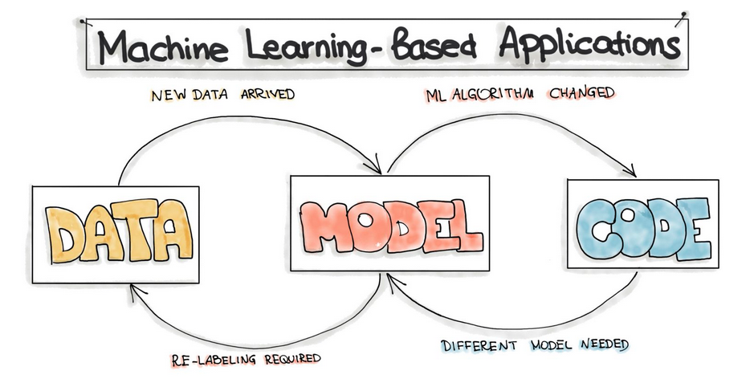

## Why use ML?
* Data-driven world
* Increasing importance of Artificial Intelligence / Machine Learning / Data Science

#### ML Functionalities
* Recommendation, which identifies the relevant product in a large collection based on the product description or user’s previous interactions.
* Top-K Items Selection, which organizes a set of items in a particular order that is suitable for user (e.g. search result).
* Classification, which assigns the input examples to one of the previously defined classes (e.g “spam”/”not spam”).
* Prediction, which assigns some most probable value to an entity of interest, such as stock value.
* Content Generation, to produce new content by learning from existing examples, such as finishing a Bach chorale cantata by learning from his former compositions.
* Question Answering, which answers an explicit question for example: “Does this text describe this image?”
* Automation, which can be a set of user steps performed automatically, such as stock trading
* Fraud and Anomaly Detection, to identify an action or transaction being a fraud or suspicious
* Information Extraction and Annotation, to identify important information in a text, such as people’s names, job descriptions, companies, and locations.

#### Changes and State
The ML-based applications is fundamentally different from the development of the traditional software. 
The complete development pipeline includes three levels of change: **Data, ML Model, and Code** 

#### Common Issues of ML Models in PROD
* Data quality: since ML models are built on data, they are sensitive to the semantics, amount and completeness of incoming data.
* Model decay: the performance of ML models in production degenerate over time because of changes in the real-life data that has not been seen during the model training.
* Locality: when transferring ML models to new business customers, these models, which have been pre-trained on different user demographics, might not work correctly according to quality metrics.

## ML Workflow
Every ML-based software includes three main artifacts: 
* Data engineering: data acquisition & data preparation
* ML model engineering: ML model training & serving
* Code engineering: integrating ML model into the final product.

#### Data Engineering
Data engineering operations:
1. Data Ingestion – Collecting data by using various frameworks and formats, such as Spark, HDFS, CSV, etc. This step might also include synthetic data generation or data enrichment.
2. Exploration and Validation – Includes data profiling to obtain information about the content and structure of the data. The output of this step is a set of metadata, such as max, min, avg of values. Data validation operations are user-defined error detection functions, which scan the dataset in order to spot some errors.
3. Data Wrangling (Cleaning) – The process of re-formatting particular attributes and correcting errors in data, such as missing values imputation.
4. Data Labeling – The operation of the Data Engineering pipeline, where each data point is assigned to a specific category.
5. Data Splitting – Splitting the data into training, validation, and test datasets to be used during the core machine learning stages to produce the ML model.

#### Model/ML Engineering
Model engineering operations:
1. Model Training – The process of applying the machine learning algorithm on training data to train an ML model. It also includes feature engineering and the hyperparameter tuning for the model training activity.
2. Model Evaluation – Validating the trained model to ensure it meets original codified objectives before serving the ML model in production to the end-user.
3. Model Testing – Performing the final “Model Acceptance Test” by using the hold backtest dataset.
4. Model Packaging – The process of exporting the final ML model into a specific format (e.g. PMML, PFA, or ONNX), which describes the model, in order to be consumed by the business application.

#### Deployment (Code Engineering)
The final stage of the ML workflow is the integration of the previously engineered ML model into existing software. This stage includes the following operations:
1. Model Serving – The process of addressing the ML model artifact in a production environment.
2. Model Performance Monitoring – The process of observing the ML model performance based on live and previously unseen data, such as prediction or recommendation. In particular, we are interested in ML-specific signals, such as prediction deviation from previous model performance. These signals might be used as triggers for model re-training.
3. Model Performance Logging – Every inference request results in the log-record.

