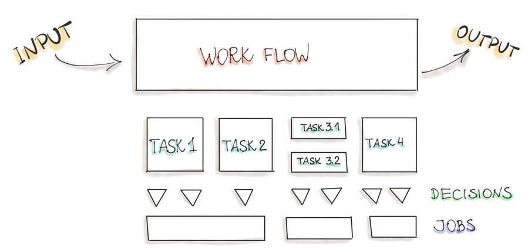
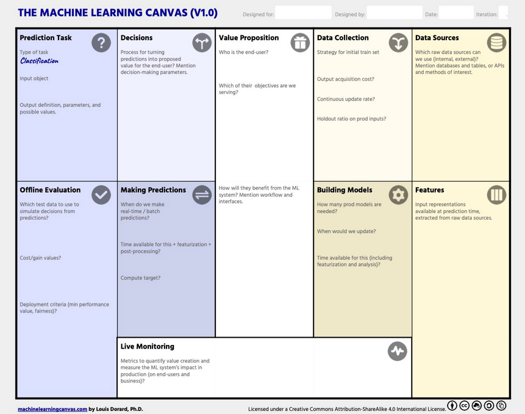

## Why use ML?
* Data-driven world
* Increasing importance of Artificial Intelligence / Machine Learning / Data Science

#### ML Functionalities
* Recommendation: identifies the relevant product in a large collection based on the product description or user’s previous interactions.
* Top-K Items Selection: organizes a set of items in a particular order that is suitable for user (e.g. search result).
* Classification: assigns the input examples to one of the previously defined classes (e.g “spam”/”not spam”).
* Prediction: assigns some most probable value to an entity of interest, such as stock value.
* Content Generation: to produce new content by learning from existing examples, such as finishing a Bach chorale cantata by learning from his former compositions.
* Question Answering: answers an explicit question for example: “Does this text describe this image?”
* Automation: can be a set of user steps performed automatically, such as stock trading
* Fraud and Anomaly Detection: to identify an action or transaction being a fraud or suspicious
* Information Extraction and Annotation: to identify important information in a text, such as people’s names, job descriptions, companies, and locations.

#### Changes and State
The ML-based applications is fundamentally different from the development of the traditional software. 
The complete development pipeline includes three levels of change: **Data, ML Model, and Code** 

#### Common Issues of ML Models in PROD
* Data quality: since ML models are built on data, they are sensitive to the semantics, amount and completeness of incoming data.
* Model decay: the performance of ML models in production degenerate over time because of changes in the real-life data that has not been seen during the model training.
* Locality: when transferring ML models to new business customers, these models, which have been pre-trained on different user demographics, might not work correctly according to quality metrics.

## ML Workflow
Every ML-based software includes three main artifacts: 
* Data engineering: data acquisition & data preparation
* ML model engineering: ML model training & serving
* Code engineering: integrating ML model into the final product.

#### Data Engineering
Data engineering operations:
1. Data Ingestion – Collecting data by using various frameworks and formats, such as Spark, HDFS, CSV, etc. This step might also include synthetic data generation or data enrichment.
2. Exploration and Validation – Includes data profiling to obtain information about the content and structure of the data. The output of this step is a set of metadata, such as max, min, avg of values. Data validation operations are user-defined error detection functions, which scan the dataset in order to spot some errors.
3. Data Wrangling (Cleaning) – The process of re-formatting particular attributes and correcting errors in data, such as missing values imputation.
4. Data Labeling – The operation of the Data Engineering pipeline, where each data point is assigned to a specific category.
5. Data Splitting – Splitting the data into training, validation, and test datasets to be used during the core machine learning stages to produce the ML model.

#### Model/ML Engineering
Model engineering operations:
1. Model Training – The process of applying the machine learning algorithm on training data to train an ML model. It also includes feature engineering and the hyperparameter tuning for the model training activity.
2. Model Evaluation – Validating the trained model to ensure it meets original codified objectives before serving the ML model in production to the end-user.
3. Model Testing – Performing the final “Model Acceptance Test” by using the hold backtest dataset.
4. Model Packaging – The process of exporting the final ML model into a specific format (e.g. PMML, PFA, or ONNX), which describes the model, in order to be consumed by the business application.

#### Deployment (Code Engineering)
The final stage of the ML workflow is the integration of the previously engineered ML model into existing software. This stage includes the following operations:
1. Model Serving – The process of addressing the ML model artifact in a production environment.
2. Model Performance Monitoring – The process of observing the ML model performance based on live and previously unseen data, such as prediction or recommendation. In particular, we are interested in ML-specific signals, such as prediction deviation from previous model performance. These signals might be used as triggers for model re-training.
3. Model Performance Logging – Every inference request results in the log-record.

## Design ML-Powered Software
The most important phase in any software project is to understand the business problem and create requirements. The initial step includes a thorough study of business problems and requirements. These requirements are translated into the model objectives and the model outputs. Possible errors and minimum success for launching need to be specified. The most useful question to continue working on the AI/ML solution is “how costly are wrong predictions?” Answering that question will define the feasibility of the ML project.

#### Process/Planning

To answer the question “how to implement AI/ML”, we follow the next steps:
1. Identify the concrete process that might be powered by AI/ML (see the Figure above).
2. Decompose that process into a directed graph of tasks.
3. Identify where humans can be removed from the task, meaning, what task can be replaced by a prediction element such as ML model?
4. Estimate the ROI for implementing an AI/ML tool to perform each task.
5. Rank-order the AI/ML implementation for each task in terms of ROI.
6. Start from the top of the list and structure the AI/ML implementation by completing either the AI Canvas or the Machine Learning Canvas.

#### AI Canvas
The AI Canvas and Machine Learning Canvas assist to structure the breakdown process. They also help to articulate exactly what is needed to predict and how we react on errors made by the prediction algorithm.

#### ML Canvas
This canvas structures the ML project and helps to specify the core requirements to realise the project. 

**What is the Value?** 
This is the crucial blocks in the whole canvas. Here we should answer three important questions:
* What is the problem? What objective are we serving? What are we trying to do for the end-user?
* Why is it important?
* Who is the end-user? Can we specify the persona?

**Data Sources** 
We clarify all available and possible data sources to be used for the ML task.
* Internal/external databases
* Data marts, OLAP cubes, data warehouses, OLTP systems
* Hadoop clusters
* REST APIs to gather data
* Static files, spreadsheets
* Web scraping
* The output of other (ML) systems
* Open-source data sets
Furthermore, we should clarify the hidden costs of a machine learning application. 
* How expensive could get the data storage?
* Should we purchase external data?
* What data assess tools and processes are available to make data accessible from other systems?

**Predictions** 
After clarifying what data is available, we brainstorm what type of ML should be used. 
* Supervised or unsupervised learning?
* Is this anomaly detection?
* Is the problem about which option should be taken? (recommendation)
* Do we need to predict a continuous value? (regression)
* Which category need to be predicted? (classification)
* Do we need to group our data? (clustering)
* If supervised, what type of ML task should be taken: classification, regression, or ranking?
* If classification, will it be binary- or multiclass classification task?
* What is the input for a prediction task?
  * e.g. E-mail text.
* What is the output of the prediction task?
  * e.g. “spam” and “regular”
* What is the degree of complexity our ML Model could assume?
  * e.g. is our model a combination of other ML models? Do we employ ensemble learning? How many hidden layers included in the deep learning model?
* What are the complexity costs, such as training and inference time, for the above models?

**Features (Engineering)** 
As every ML algorithm requires input data in the form of features, we should clarify how should the input data be represented.
* How do we extract features from raw sources?
* Consider to include domain experts to specify what data aspects are most important for the particular ML task.

